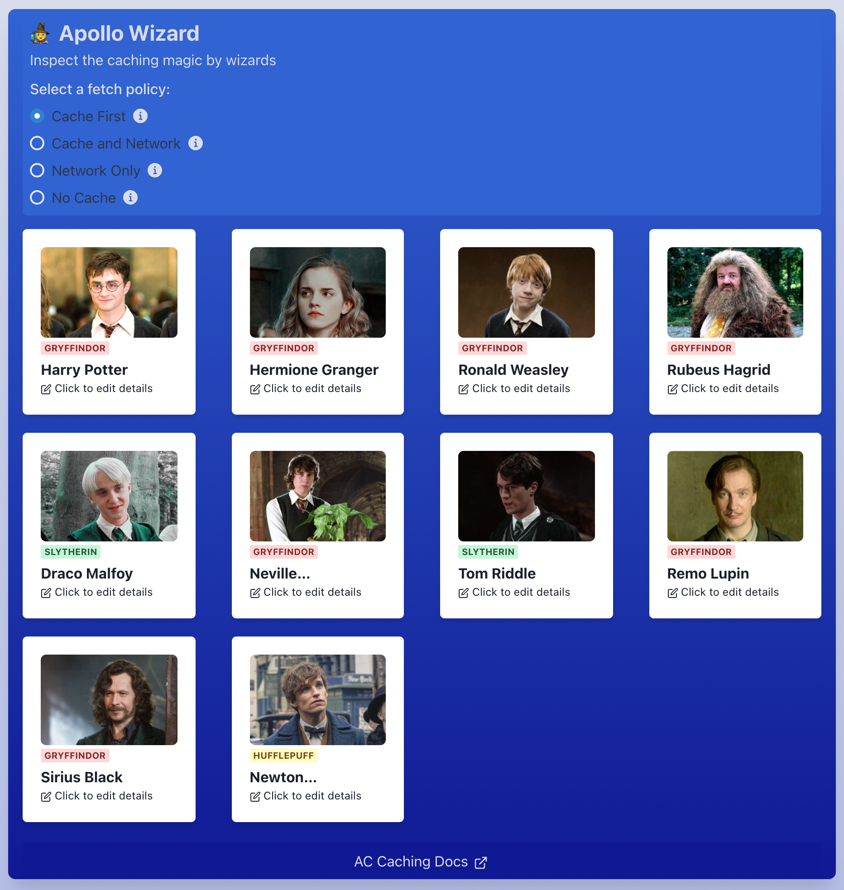

   

# Wizards Apollo 
> Application used for my talk about caching management with Apollo Client 3

 

  

## Resources
- [Apollo Day Talk](https://www.youtube.com/watch?v=PcAl3lRF4fQ&t=8s)
- [GraphQL Summit Talk]() - Coming soon

## Topics covered 
- Differences between fetch policies options: Inspect by selecting a fetch policy on the header menu
- [Customize key fields for caching identifiers](https://github.com/LauraBeatris/wizards-apollo/blob/05c2c84c86785e7ca87fcd517cb2e0d537303e06/src/config/apolloClient.js#L8)
- [Update local data - Directly update cache after mutations](https://github.com/LauraBeatris/wizards-apollo/tree/update-local-data-without-refetch-queries): Check mutation hooks to inspect code
- [Update local data - Refetch queries after mutation](https://github.com/LauraBeatris/wizards-apollo/tree/update-local-data-with-refetch-queries): Check mutation hooks to inspect code
- [Use field policies to create custom client-side fields](https://github.com/LauraBeatris/wizards-apollo/blob/6395f7059b56e17ef8148cd4430b52223cb9658a/src/config/apolloClient.js#L8)
- Pagination helpers

